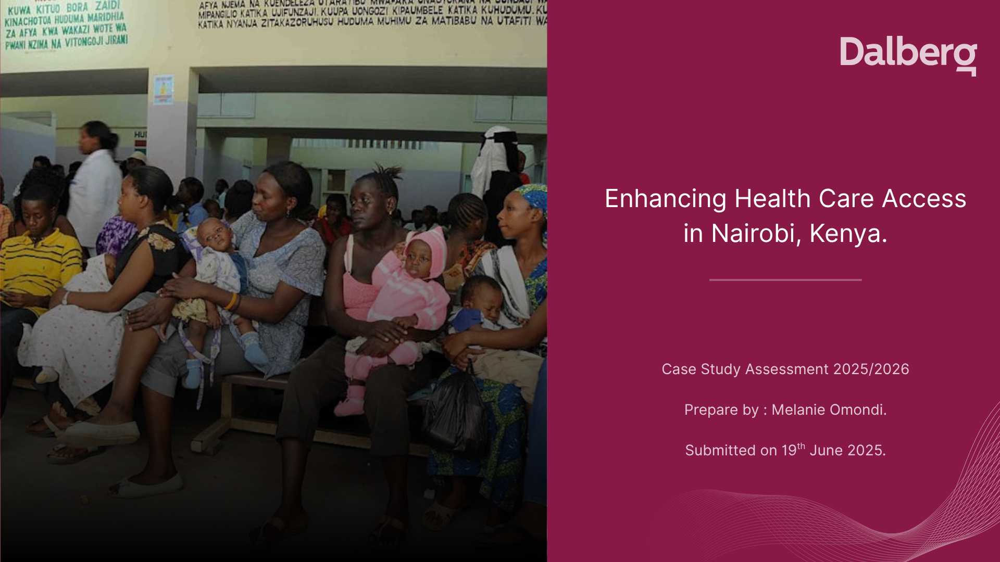
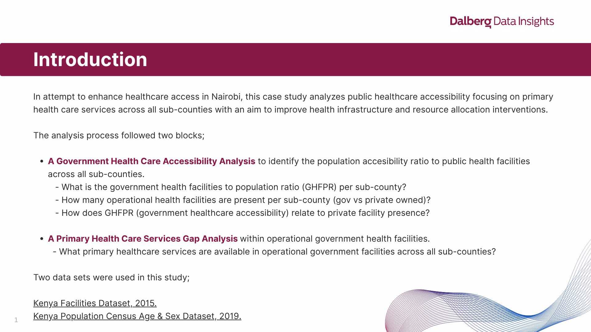
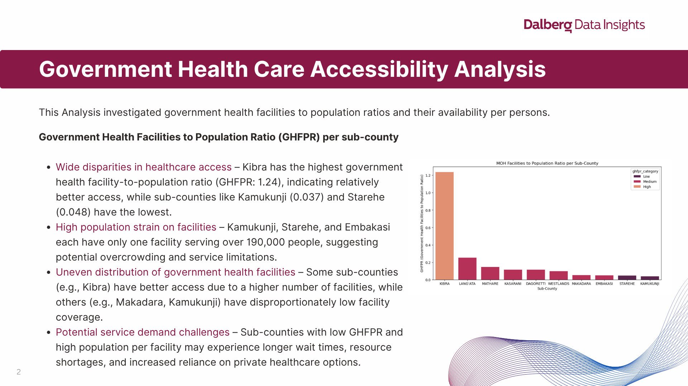
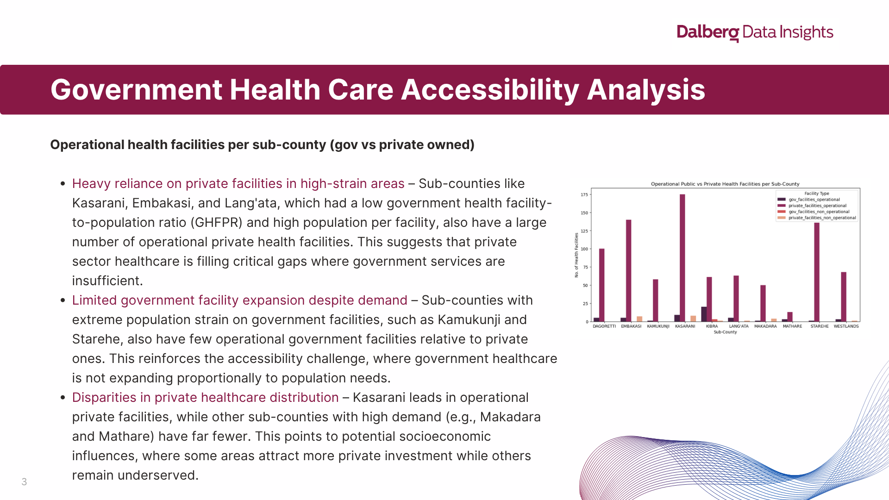
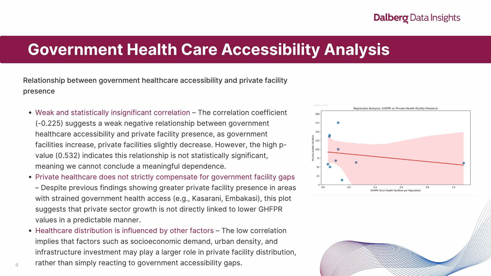
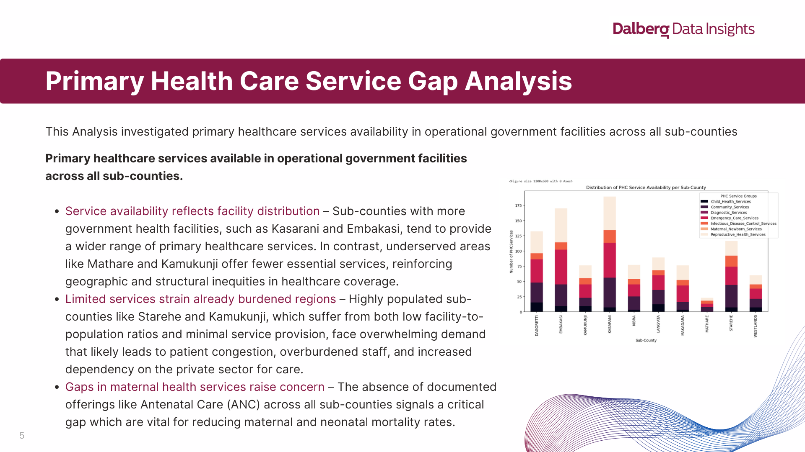
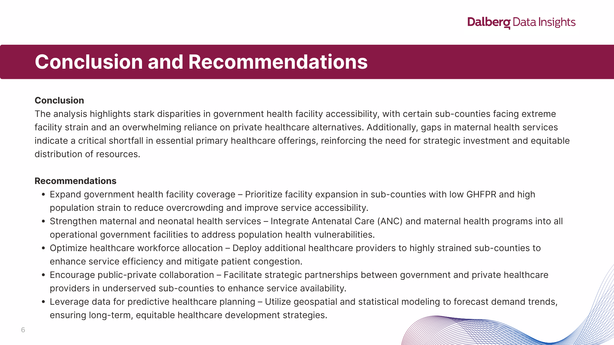

# enhancing_healthcare_nairobi

## Enhancing Healthcare Accessibility in Nairobi, Kenya (Dalberg Data Insights)
This project aimed at improving Nairobi's population's access to primary healthcare services within operational government health facilities. The spatial analysis used the operational government health facilities to population ratio as a measure of access across all sub-counties in Nairobi, as well as exploring the presence of operational private health facilities compared to minimal government health facilities present. In addition, I explored primary health care services present within the health facilities.

### 1. Background
The Nairobi County Health Officer has engaged Dalberg Data Insights (DDI) to help address disparities in access to quality healthcare across the county. The office has secured an external grant to improve health infrastructure and resource allocation, but they require data-driven insights to prioritize investments effectively. 

The Health Officer's key goal is to ensure equitable access to healthcare for all residents in Nairobi, in alignment with Sustainable Development Goal(SDG)3, which aims to ensure healthy lives and promote well-being for all at all ages. To support this, Dalberg Data Insights (DDI) has been tasked with analyzing existing datasets to localize the most significant gaps in the current healthcare infrastructure, with a focus on primary healthcare services, and propose actionable recommendations for improvement. 

### 2. Data
– Raw Excel workbook containing all sheets:[Data](assets/data)
#### Health Facilities Table Sample
|   Facility Code | Facility Name                                                               | Province      | County          | District                   | Division               | Type                                         | Owner                                           | Location                  | Sub Location               | Description of Location                                                                                                                                                                                   | Constituency       | Nearest Town                                                                          |   Beds |   Cots | Official Landline                               | Official Fax         | Official Mobile           | Official Email                                      | Official Address                               |   Official Alternate No | Town                      | Post Code     | In Charge                                     | Job Title of in Charge    | Open 24 Hours   | Open Weekends   | Operational Status   |   ANC | ART   |   BEOC |   BLOOD |   CAES SEC |   CEOC | C-IMCI   |   EPI | FP   |   GROWM | HBC   |   HCT | IPD   |   OPD |   OUTREACH |   PMTCT |   RAD/XRAY |   RHTC/RHDC |   TB DIAG |   TB LABS |   TB TREAT |   YOUTH |
|----------------:|:----------------------------------------------------------------------------|:--------------|:----------------|:---------------------------|:-----------------------|:---------------------------------------------|:------------------------------------------------|:--------------------------|:---------------------------|:----------------------------------------------------------------------------------------------------------------------------------------------------------------------------------------------------------|:-------------------|:--------------------------------------------------------------------------------------|-------:|-------:|:------------------------------------------------|:---------------------|:--------------------------|:----------------------------------------------------|:-----------------------------------------------|------------------------:|:--------------------------|:--------------|:----------------------------------------------|:--------------------------|:----------------|:----------------|:---------------------|------:|:------|-------:|--------:|-----------:|-------:|:---------|------:|:-----|--------:|:------|------:|:------|------:|-----------:|--------:|-----------:|------------:|----------:|----------:|-----------:|--------:|
|           19224 | CDF Kiriari Dispensary                                                      | Eastern       | Embu            | Manyatta                   | Manyatta               | Dispensary                                   | Ministry of Health                              | Ruguru                    | Ruguru                     | nan                                                                                                                                                                                                       | MANYATTA           | Kiriari -market                                                                       |      0 |      0 | nan                                             | nan                  | nan                       | nan                                                 | nan                                            |           nan           | 148                       | nan           | Catherine Njoki Mugo                          | Nursing Officer in Charge | nan             | nan             | Operational          |   nan | nan   |    nan |     nan |        nan |    nan | nan      |   nan | nan  |     nan | nan   |   nan | nan   |   nan |        nan |     nan |        nan |         nan |       nan |       nan |        nan |     nan |
|           19310 | St Jude's Huruma Community Health Services                                  | Nairobi       | Nairobi         | Mathare                    | Huruma                 | Medical Clinic                               | Private Practice - Unspecified                  | Huruma                    | Huruma                     | Situated near Ndururumo Primary School (Juja Rd/OuterRd Junction)                                                                                                                                         | MATHARE            | Kariobangi Market                                                                     |      0 |      0 | 020237354                                       | nan                  | nan                       | stjudes2008@yahoo.com                               | nan                                            |           nan           | nan                       | nan           | Caroline Achieng                              | Clinical Officer          | N               | Y               | Operational          |   nan | nan   |    nan |     nan |        nan |    nan | nan      |   nan | nan  |     nan | nan   |   nan | nan   |   nan |        nan |     nan |        nan |         nan |       nan |       nan |        nan |     nan |
|           14180 | 10 Engineer VCT                                                             | Rift Valley   | Laikipia        | Laikipia East              | Central                | Dispensary                                   | Armed Forces                                    | Nanyuki                   | Majengo                    | nan                                                                                                                                                                                                       | LAIKIPIA EAST      | Nanyuki                                                                               |      0 |      0 | nan                                             | nan                  | nan                       | nan                                                 | nan                                            |           nan           | nan                       | nan           | Cpt Kiplagat                                  | Medical Superintendant    | N               | N               | Operational          |   nan | Y     |    nan |     nan |        nan |    nan | nan      |   nan | Y    |     nan | Y     |   nan | nan   |   nan |        nan |     nan |        nan |         nan |       nan |       nan |        nan |     nan |
|           17486 | 12 Engineers                                                                | Central       | Kiambu          | Thika West                 | nan                    | Dispensary                                   | Ministry of Health                              | nan                       | nan                        | nan                                                                                                                                                                                                       | JUJA               | nan                                                                                   |      0 |      0 | nan                                             | nan                  | nan                       | nan                                                 | nan                                            |           nan           | nan                       | nan           | nan                                           | nan                       | N               | N               | Operational          |   nan | nan   |    nan |     nan |        nan |    nan | nan      |   nan | nan  |     nan | nan   |   nan | nan   |   nan |        nan |     nan |        nan |         nan |       nan |       nan |        nan |     nan |
|           18393 | 3Kl Maternity & Nursing Home                                                | Rift Valley   | Kajiado         | Kajiado North              | Ongata Rongai          | Nursing Home                                 | Private Practice - Clinical Officer             | Gataka                    | Gataka                     | Gataka Road                                                                                                                                                                                               | KAJIADO NORTH      | Ongata Ronga                                                                          |      7 |      0 | nan                                             | nan                  | 0733231565                | kanyokanyokltd@gmail.com                            | P.O Box 15356                                  |           nan           | Langata                   | 00509         | Jeffrey Mikombi Akide                         | Clinical Officer          | Y               | Y               | Operational          |   nan | nan   |    nan |     nan |        nan |    nan | nan      |   nan | nan  |     nan | nan   |   nan | nan   |   nan |        nan |     nan |        nan |         nan |       nan |       nan |        nan |     nan |
|           14181 | 3KR Health Centre                                                           | Rift Valley   | Nakuru          | Nakuru                     | Lanet                  | Health Centre                                | Armed Forces                                    | Lanet                     | Lanet                      | within the 3KR barracks off nakuru ndudori road                                                                                                                                                           | NAKURU TOWN        | Nakuru Town                                                                           |     20 |     12 | nan                                             | nan                  | nan                       | nan                                                 | P.O Box 301                                    |           nan           | Nakuru                    | 20100         | Mr Lugonzo                                    | Nursing Officer in Charge | Y               | Y               | Operational          |   nan | Y     |    nan |     nan |        nan |    nan | Y        |   nan | Y    |     nan | Y     |   nan | Y     |   nan |        nan |     nan |        nan |         nan |       nan |       nan |        nan |     nan |
|           11917 | 78 Tank Battalion Dispensary                                                | Eastern       | Isiolo          | Isiolo                     | Central                | Dispensary                                   | Armed Forces                                    | East                      | East                       | nan                                                                                                                                                                                                       | ISIOLO NORTH       | Isiolo                                                                                |      7 |      2 | 064-52243                                       | 064-52160            | 0721436270                | isiolohealth@yahoo.com                              | Please specify P.O. Box 66                     |             7.0038e+08  | Isiolo                    | 60300         | Major Onjolo                                  | Nursing Officer in Charge | Y               | Y               | Operational          |   nan | nan   |    nan |     nan |        nan |    nan | nan      |   nan | Y    |     nan | Y     |   nan | Y     |   nan |        nan |     nan |        nan |         nan |       nan |       nan |        nan |     nan |
|           13043 | 7Kr Mrs Health Centre                                                       | Nairobi       | Nairobi         | Langata                    | Lang'ata               | Health Centre                                | Armed Forces                                    | Mugumoini                 | Mugumoini                  | Next to Nairobi Opharnage,Off Lang'ata rd.                                                                                                                                                                | LANG'ATA           | Lang'ata Shopping Center                                                              |     14 |      0 | nan                                             | nan                  | nan                       | nan                                                 | P.O Box 44008                                  |           nan           | Nairobi                   | 00100         | Captain Murunga                               | Nursing Officer in Charge | Y               | Y               | Operational          |   nan | nan   |    nan |     nan |        nan |    nan | Y        |   nan | Y    |     nan | Y     |   nan | Y     |   nan |        nan |     nan |        nan |         nan |       nan |       nan |        nan |     nan |
|           14182 | 8Th Street Clinic                                                           | Rift Valley   | Kajiado         | Kajiado North              | Isinya                 | Medical Clinic                               | Private Enterprise (Institution)                | Isinya                    | Isinya Township            | Isinya Township                                                                                                                                                                                           | KAJIADO NORTH      | Isinya                                                                                |      0 |      0 | nan                                             | nan                  | 0720-267629               | nan                                                 | P.O Box 8626                                   |           nan           | Nairobi                   | 00300         | Freshia Kairogu                               | Nursing Officer in Charge | N               | Y               | Operational          |   nan | nan   |    nan |     nan |        nan |    nan | nan      |   nan | nan  |     nan | nan   |   nan | nan   |   nan |        nan |     nan |        nan |         nan |       nan |       nan |        nan |     nan |
|           18137 | A To Z Quality Health Family Health Services                                | Rift Valley   | Nakuru          | Njoro                      | Njoro                  | Medical Clinic                               | Private Practice - Nurse / Midwife              | Njoro                     | Njoro                      | nan                                                                                                                                                                                                       | MOLO               | Njoro Centre                                                                          |      0 |      0 | nan                                             | nan                  | nan                       | nan                                                 | P.O Box 12514                                  |           nan           | nan                       | nan           | Basiro Kariuki                                | Nursing Officer in Charge | N               | Y               | Operational          |   nan | nan   |    nan |     nan |        nan |    nan | nan      |   nan | nan  |     nan | nan   |   nan | nan   |   nan |        nan |     nan |        nan |         nan |       nan |       nan |        nan |     nan |
|           20346 | AAR Adams Health Centre                                                     | Nairobi       | Nairobi         | Kibra                      | Woodly                 | Medical Clinic                               | Private Practice - General Practitioner         | Woodly                    | Woodly                     | Greenhouse Adams 1st Floor                                                                                                                                                                                | KIBRA              | Adams                                                                                 |      0 |      0 | 0202608570                                      | nan                  | 0731191077                | nan                                                 | P.O Box 41766                                  |             7.0666e+08  | Nairobi                   | 00100         | Dr Mbuthia Wacera                             | Medical Superintendant    | N               | Y               | Operational          |   nan | nan   |    nan |     nan |        nan |    nan | nan      |   nan | nan  |     nan | nan   |   nan | nan   |   nan |        nan |     nan |        nan |         nan |       nan |       nan |        nan |     nan |
|           12861 | AAR City Centre Clinic                                                      | Nairobi       | Nairobi         | Starehe                    | Starehe                | Medical Clinic                               | Private Enterprise (Institution)                | Central Business District | nan                        | Stiuated at ICEA Building along Kenyatta Avenue(6th Froor)                                                                                                                                                | STAREHE            | Nairobi                                                                               |      0 |      0 | 02031893124                                     | nan                  | nan                       | emutugi@aar.co.ke                                   | P.O Box 41766                                  |           nan           | Nairobi                   | 00100         | Dr. Alma Okudo                                | Doctor In Charge          | N               | Y               | Operational          |   nan | nan   |    nan |     nan |        nan |    nan | nan      |   nan | Y    |     nan | nan   |   nan | Y     |   nan |        nan |     nan |        nan |         nan |       nan |       nan |        nan |     nan |
|           16796 | AAR Clinic Sarit Centre (Westlands)                                         | Nairobi       | Nairobi         | Westlands                  | Parklands              | Medical Clinic                               | Private Enterprise (Institution)                | Parklands                 | Upper Parklands            | In Sarit Centre westlands                                                                                                                                                                                 | WESTLANDS          | Nairobi                                                                               |      0 |      0 | nan                                             | nan                  | nan                       | nan                                                 | nan                                            |           nan           | nan                       | nan           | nan                                           | Nursing Officer in Charge | N               | N               | Operational          |   nan | nan   |    nan |     nan |        nan |    nan | nan      |   nan | nan  |     nan | nan   |   nan | nan   |   nan |        nan |     nan |        nan |         nan |       nan |       nan |        nan |     nan |
|           18178 | AAR Eldoret                                                                 | Rift Valley   | Uasin Gishu     | Eldoret West               | Turbo                  | Medical Clinic                               | Private Practice - General Practitioner         | nan                       | nan                        | nan                                                                                                                                                                                                       | ELDORET NORTH      | Eldoret                                                                               |      0 |      0 | nan                                             | nan                  | nan                       | nan                                                 | nan                                            |           nan           | Eldoret                   | 03000         | nan                                           | Doctor In Charge          | Y               | Y               | Operational          |   nan | nan   |    nan |     nan |        nan |    nan | nan      |   nan | nan  |     nan | nan   |   nan | nan   |   nan |        nan |     nan |        nan |         nan |       nan |       nan |        nan |     nan |
|           19958 | AAR Gwh Health Care Ltd                                                     | Nairobi       | Nairobi         | Dagoretti North            | Kilimani               | Health Centre                                | Private Enterprise (Institution)                | nan                       | nan                        | nan                                                                                                                                                                                                       | DAGORETTI NORTH    | nan                                                                                   |      0 |      0 | nan                                             | nan                  | 0722778040                | ciokudo@caricoike                                   | nan                                            |           nan           | Nairobi                   | nan           | Dr. Alma Okudo                                | nan                       | N               | Y               | Operational          |   nan | nan   |    nan |     nan |        nan |    nan | nan      |   nan | nan  |     nan | nan   |   nan | nan   |   nan |        nan |     nan |        nan |         nan |       nan |       nan |        nan |     nan |
|           20405 | AAR Health Care                                                             | Nairobi       | Nairobi         | Embakasi East              | Embakasi               | Health Centre                                | Private Practice - Medical Specialist           | Embakasi                  | Tassia                     | nan                                                                                                                                                                                                       | EMBAKASI EAST      | Donholm                                                                               |      6 |      2 | 0733888259                                      | nan                  | 073388259                 | dkamau@aar.co.ke                                    | nan                                            |           nan           | Nairobi                   | 00100         | Dr Kamau David                                | Hospital Director         | N               | Y               | Operational          |   nan | nan   |    nan |     nan |        nan |    nan | nan      |   nan | nan  |     nan | nan   |   nan | nan   |   nan |        nan |     nan |        nan |         nan |       nan |       nan |        nan |     nan |
|           20956 | AAR Health Care-Kisumu                                                      | Nyanza        | Kisumu          | Kisumu East                | Winam                  | Medical Clinic                               | Private Practice - General Practitioner         | Township                  | Market Milimani            | Located at AL IMRAN at Oginga Odinga street                                                                                                                                                               | KISUMU TOWN EAST   | Central Business District                                                             |      0 |      0 | 0572024892                                      | nan                  | 0208098691                | nan                                                 | P.O Box 2746                                   |             7.28442e+08 | Kisumu                    | 40100         | Vincent Hongo                                 | Hospital Director         | N               | Y               | Operational          |   nan | nan   |    nan |     nan |        nan |    nan | nan      |   nan | nan  |     nan | nan   |   nan | nan   |   nan |        nan |     nan |        nan |         nan |       nan |       nan |        nan |     nan |
|           18859 | AAR Healthcare Limited (Karen)                                              | Nairobi       | Nairobi         | Langata                    | Lang'ata               | Medical Clinic                               | Private Enterprise (Institution)                | Lang'ata                  | Lang'ata                   | Next to Nairobi Pentecostal Church Karen, Opposite Catholic University along Langata Road.                                                                                                                | LANG'ATA           | Great Jubilee shopping  center                                                        |      0 |      0 | 0202631852                                      | nan                  | 0729876092                | info@aar.co.ke                                      | P.O Box 41766                                  |             7.35963e+08 | Nairobi                   | 00100         | Eunice Kamau                                  | Nursing Officer in Charge | N               | Y               | Operational          |   nan | nan   |    nan |     nan |        nan |    nan | nan      |   nan | nan  |     nan | nan   |   nan | nan   |   nan |        nan |     nan |        nan |         nan |       nan |       nan |        nan |     nan |
|           12862 | AAR Kariobangi Clinic                                                       | Nairobi       | Nairobi         | Ruaraka                    | Kasarani               | Medical Clinic                               | Private Enterprise (Institution)                | Kasarani                  | nan                        | nan                                                                                                                                                                                                       | RUARAKA            | Nairobi                                                                               |      0 |      0 | nan                                             | nan                  | nan                       | nan                                                 | nan                                            |           nan           | nan                       | nan           | nan                                           | nan                       | N               | N               | Not-Operational      |   nan | nan   |    nan |     nan |        nan |    nan | nan      |   nan | nan  |     nan | nan   |   nan | nan   |   nan |        nan |     nan |        nan |         nan |       nan |       nan |        nan |     nan |
|           11194 | AAR Medical Services (Docks)                                                | Coast         | Mombasa         | Mvita                      | Island                 | Medical Clinic                               | Private Enterprise (Institution)                | Ganjoni                   | Ganjoni                    | At Lulu House next to Railway Station                                                                                                                                                                     | MVITA              | Mombasa                                                                               |      0 |      0 | nan                                             | nan                  | nan                       | nan                                                 | nan                                            |           nan           | nan                       | nan           | Peter Munira                                  | nan                       | N               | N               | Operational          |   nan | nan   |    nan |     nan |        nan |    nan | nan      |   nan | nan  |     nan | nan   |   nan | nan   |   nan |        nan |     nan |        nan |         nan |       nan |       nan |        nan |     nan |
|           20140 | AAR Mountain mall                                                           | Nairobi       | Nairobi         | Roysambu                   | Roysambu               | Medical Clinic                               | Private Practice - Nurse / Midwife              | Roysambu                  | Garden                     | In  the mountain mall Naivas mall building                                                                                                                                                                | ROYSAMBU           | Rosters                                                                               |      0 |      0 | nan                                             | nan                  | 0733888258                | smutunga@aar.co.ke                                  | P.O Box 41766                                  |             7.2176e+08  | Nairobi                   | 00100         | Stephanie Mutunga                             | Nursing Officer in Charge | N               | Y               | Operational          |   nan | nan   |    nan |     nan |        nan |    nan | nan      |   nan | nan  |     nan | nan   |   nan | nan   |   nan |        nan |     nan |        nan |         nan |       nan |       nan |        nan |     nan |
|           14183 | AAR Nakuru Clinic                                                           | Rift Valley   | Nakuru          | Nakuru                     | Municipality           | Dispensary                                   | Non-Governmental Organizations                  | Central                   | Viwanda                    | at Giddo plaza ground floor                                                                                                                                                                               | NAKURU TOWN        | Nakuru Town                                                                           |      0 |      0 | 051215599                                       | 0512214910           | nan                       | antonine@aar.go.ke                                  | P.O Box P.O. Box 7097                          |           nan           | Nakuru                    | 20100         | Antonina Musoga                               | Nursing Officer in Charge | N               | Y               | Operational          |   nan | nan   |    nan |     nan |        nan |    nan | nan      |   nan | nan  |     nan | nan   |   nan | Y     |   nan |        nan |     nan |        nan |         nan |       nan |       nan |        nan |     nan |
|           21224 | AAR Outpatient Center Donholm                                               | Nairobi       | Nairobi         | Embakasi East              | Embakasi East          | Medical Clinic                               | Private Practice - General Practitioner         | Upper Savanna             | Donholm                    | Donholm next to total petrol station formerly caltex                                                                                                                                                      | EMBAKASI EAST      | Donholm                                                                               |      4 |      2 | nan                                             | nan                  | 0733881420                | nan                                                 | P.O Box 41766                                  |             7.70257e+08 | Nairobi                   | 00100         | Sarah Orinda                                  | Nursing Officer in Charge | N               | Y               | Operational          |   nan | nan   |    nan |     nan |        nan |    nan | nan      |   nan | nan  |     nan | nan   |   nan | nan   |   nan |        nan |     nan |        nan |         nan |       nan |       nan |        nan |     nan |
...
|           15788 | Ziwa Sub-District Hospital                                                  | Rift Valley   | Uasin Gishu     | Eldoret West               | Soy                    | Sub-District Hospital                        | Ministry of Health                              | Sirikwa                   | Sirikwa                    | nan                                                                                                                                                                                                       | ELDORET NORTH      | Eldoret                                                                               |     20 |      4 | nan                                             | nan                  | nan                       | nan                                                 | P.O Box 589                                    |           nan           | Ziwa                      | 30100         | Edwin Mugunda                                 | Medical Superintendant    | N               | N               | Operational          |   nan | nan   |    nan |     nan |        nan |    nan | nan      |   nan | Y    |     nan | nan   |   nan | Y     |   nan |        nan |     nan |        nan |         nan |       nan |       nan |        nan |     nan |
|           11915 | Ziwani Dispensary                                                           | Coast         | Taita Taveta    | Taveta                     | Challa                 | Dispensary                                   | Private Enterprise (Institution)                | Challa                    | Ziwani                     | Ziwani is located at Mohoho Kenyatta Farm Near Njukini Health Centre                                                                                                                                      | TAVETA             | Challa                                                                                |      0 |      0 | nan                                             | nan                  | nan                       | nan                                                 | P.O Box P.O. Box 31                            |           nan           | Taveta                    | nan           | Boniface Tuva                                 | Nursing Officer in Charge | N               | N               | Operational          |   nan | nan   |    nan |     nan |        nan |    nan | nan      |   nan | Y    |     nan | Y     |   nan | Y     |   nan |        nan |     nan |        nan |         nan |       nan |       nan |        nan |     nan |
|           16997 | Zombe Catholic Dispensary                                                   | Eastern       | Kitui           | Mutitu                     | zombe/mwitika ward     | Dispensary                                   | Kenya Episcopal Conference-Catholic Secretariat | Zombe                     | Thua                       | Near Zombe Market                                                                                                                                                                                         | MUTITO             | Zombe                                                                                 |      0 |      0 | nan                                             | nan                  | nan                       | nan                                                 | P.O Box 22                                     |           nan           | Kitui                     | 90200         | Sr. Robina Moraa                              | Nursing Officer in Charge | N               | N               | Operational          |   nan | nan   |    nan |     nan |        nan |    nan | nan      |   nan | nan  |     nan | nan   |   nan | nan   |   nan |        nan |     nan |        nan |         nan |       nan |       nan |        nan |     nan |
|           20313 | Zombe medical clinic                                                        | Eastern       | Kitui           | Mutitu                     | zombe/mwitika ward     | Medical Clinic                               | Private Practice - Clinical Officer             | Zombe                     | Malalani                   | nan                                                                                                                                                                                                       | MUTITO             | zombe town                                                                            |      1 |      0 | nan                                             | nan                  | nan                       | nan                                                 | P.O Box 37                                     |           nan           | zombe                     | 90213         | Losatima Josphat                              | Clinical Officer          | Y               | Y               | Operational          |   nan | nan   |    nan |     nan |        nan |    nan | nan      |   nan | nan  |     nan | nan   |   nan | nan   |   nan |        nan |     nan |        nan |         nan |       nan |       nan |        nan |     nan |

#### Demographic Table Sample
| county          | sub-county         | Age        | Male    | Female   | Total   |
|:----------------|:-------------------|:-----------|:--------|:---------|:--------|
| BARINGO         | ALL                | Total      | 336322  | 330428   | 666750  |
| BARINGO         | ALL                | 0          | 8303    | 7982     | 16285   |
| BARINGO         | ALL                | 1          | 8669    | 8417     | 17086   |
| BARINGO         | ALL                | 2          | 10226   | 9762     | 19988   |
| BARINGO         | ALL                | 3          | 10265   | 10086    | 20351   |
| BARINGO         | ALL                | 4          | 11045   | 10276    | 21321   |
| BARINGO         | ALL                | 0 - 4      | 48508   | 46523    | 95031   |
| BARINGO         | ALL                | 5          | 10701   | 10047    | 20748   |
| BARINGO         | ALL                | 6          | 10949   | 10422    | 21371   |
| BARINGO         | ALL                | 7          | 9595    | 9082     | 18677   |
| BARINGO         | ALL                | 8          | 10276   | 10027    | 20303   |
| BARINGO         | ALL                | 9          | 9355    | 9101     | 18456   |
| BARINGO         | ALL                | 5-9        | 50876   | 48679    | 99555   |
| BARINGO         | ALL                | 10         | 12772   | 11975    | 24747   |
| BARINGO         | ALL                | 11         | 8102    | 8365     | 16467   |
| BARINGO         | ALL                | 12         | 11844   | 10549    | 22393   |
| BARINGO         | ALL                | 13         | 9747    | 9167     | 18914   |
| BARINGO         | ALL                | 14         | 9920    | 9151     | 19071   |
| BARINGO         | ALL                | 10 -14     | 52385   | 49207    | 101592  |
| BARINGO         | ALL                | 15         | 10511   | 9330     | 19841   |
| BARINGO         | ALL                | 16         | 8720    | 8131     | 16851   |
| BARINGO         | ALL                | 17         | 8494    | 7641     | 16135   |
| BARINGO         | ALL                | 18         | 7287    | 6686     | 13973   |
...
| WEST POKOT      | WEST POKOT         | 99         | 3       | 17       | 20      |
| WEST POKOT      | WEST POKOT         | 95-99      | 18      | 52       | 70      |
| WEST POKOT      | WEST POKOT         | 100+       | 15      | 39       | 54      |
| WEST POKOT      | WEST POKOT         | Not Stated | 1       | 1        | 2       |

### 3. Project Process 

My Approach:

##### Problem Framing

- What is the government health facilities to population ratio per sub-county?
- What is the PHC services gap per sub-county?
  
##### Analysis (Government Health Care Accessibility & Availability of Primary Health Care Services)

- Government Health Care Accessibility Analysis: Facility to Population Ratio per Sub-County (Further divided by government and private facilities)
- PHC Service Gap Analysis: PHC services per Sub-County.

### 4. Findings

### 5. Project Notebook
Explore the full analysis in the Jupyter notebook:[View PDF](assets/notebook/Tech_Fellow_Task.pdf)
View the Jupyter notebook locally: [View Google Colab](https://colab.research.google.com/github/Melanie331/ili_surveillance_kenya/blob/main/assets/notebook/Tech_Fellow_Task.ipynb)

